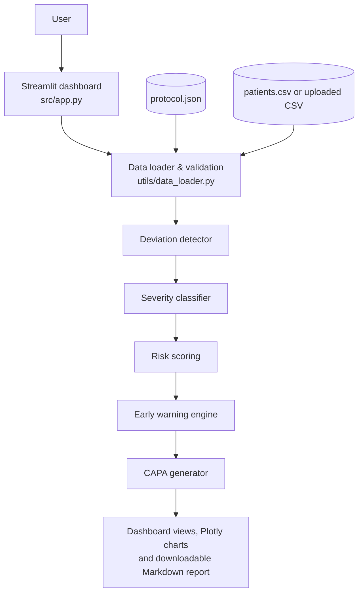

# 🛡️ TrialGuard

**Clinical Trial Risk Monitor & Protocol Deviation Detector**

> ⚠️ **Hackathon proof-of-concept.** TrialGuard uses **synthetic data only**. It is not
> clinically validated, not FDA/EMA approved, and must not be used for real clinical or
> regulatory decisions.

TrialGuard compares patient visit records against a trial protocol, finds protocol
deviations, scores every site's risk from 0 to 100, raises early warnings, and drafts a
rule-based CAPA (Corrective and Preventive Action) report for sites that need attention —
all in a local Streamlit dashboard.

---

## 1. 👥 Team

| Field | Value |
|---|---|
| **Team Name** | ⚠️ TO BE COMPLETED by the participant |
| **Track** | ⚠️ TO BE COMPLETED by the participant (AI / DevOps / Sustainability / Open) |
| **Team Lead** | ⚠️ TO BE COMPLETED by the participant |
| **Members** | ⚠️ TO BE COMPLETED by the participant |

---

## 2. 🎯 Problem

A clinical trial runs across many sites, each with many patients and scheduled visits.
**Protocol deviations** — a missed or late visit, a wrong dose, a prohibited medication —
can go unnoticed until an audit, and a single deviation rarely tells you whether a *site*
has a process problem. Clinical monitors need to see quickly **which sites need attention
first and why**, not just a long list of individual errors.

More detail: [`docs/problem-statement.md`](docs/problem-statement.md)

---

## 3. 💡 Solution

TrialGuard is a transparent, rule-based pipeline with a dashboard:

```
Patient visit CSV + protocol  →  detect deviations  →  classify severity
  →  score each site (0–100)  →  early warnings  →  CAPA report  →  dashboard
```

Instead of stopping at individual deviations, it combines **deviation detection +
severity + site-level risk + trend warnings + suggested actions** into one view, and every
number can be traced back to a readable rule in the source code.

More detail: [`docs/solution-overview.md`](docs/solution-overview.md)

---

## 4. ✨ Key Features

- **Protocol deviation detection** against a fictional protocol
  ([`src/data/protocol.json`](src/data/protocol.json)): missed visits, out-of-window
  visits, incorrect doses, prohibited medications and missing documentation.
- **Severity classification** (Major / Minor / Administrative) with a plain-English
  reason for every label.
- **Site-level risk score (0–100)** and risk level (LOW / MEDIUM / HIGH), adjusted for site
  size, with a points breakdown and the **top contributing risk factors**.
- **Early warnings**: repeated dosing errors, repeated prohibited medications,
  **increasing deviation trends** and **unusually high deviation rates**.
- **Rule-based CAPA reports** shown in the dashboard and **downloadable as Markdown**
  (`trialguard_capa_<SITE_ID>.md`).
- **Streamlit dashboard with Plotly charts**: study overview, site ranking, site details,
  early warnings, filterable deviation records and a "How it works" tab.
- **CSV upload with validation**: friendly error messages (never a Python traceback) and a
  **Completed vs Ongoing trial** option so mid-trial patients are not wrongly flagged.
- **Built-in synthetic demo data** with deliberately planted problem sites.

---

## 5. ⚙️ How TrialGuard Works

| Step | What happens | Code |
|---|---|---|
| 1. Load & validate | Reads the protocol and patient CSV; rejects broken files with clear messages; tidies visit names, removes exact duplicates | [`src/utils/data_loader.py`](src/utils/data_loader.py) |
| 2. Detect deviations | Compares every visit with the protocol | [`src/core/deviation_detector.py`](src/core/deviation_detector.py) |
| 3. Classify severity | Major / Minor / Administrative using thresholds in `config.py` | [`src/core/severity.py`](src/core/severity.py) |
| 4. Score sites | Points per deviation + repeated-pattern bonus, divided by patients, scaled to 0–100 | [`src/core/risk_scoring.py`](src/core/risk_scoring.py) |
| 5. Early warnings | Pattern and trend checks that explain (never change) the score | [`src/core/early_warning.py`](src/core/early_warning.py) |
| 6. CAPA report | Looks up issues and actions in editable rule tables | [`src/core/capa_generator.py`](src/core/capa_generator.py) |
| 7. Dashboard | Displays results; contains no business rules | [`src/app.py`](src/app.py) |

### Deviation rules

| Deviation | Rule | Severity |
|---|---|---|
| Missed visit | Record has a blank `actual_day`, or a protocol visit has no record (see Completed vs Ongoing below) | Major |
| Out-of-window visit | `actual_day` outside `expected_day ± window_days` | 1–2 days: Administrative · 3–7 days: Minor · more than 7: Major |
| Incorrect dose | `dose_mg` differs from the protocol dose (10 mg) | Major |
| Prohibited medication | Medication is on the protocol's prohibited list (DrugB, DrugC) | Major |
| Missing documentation | A visit that happened has a blank dose or medication | Administrative |

### Risk score

```
points per deviation = severity points (Major 10, Minor 4, Administrative 1)
                     + type bonus (dose +5, prohibited medication +7, missed/late visit +3)
total points         = sum of deviation points
                     + 5 for each deviation type seen in 2+ different patients at the site
points per patient   = total points ÷ patients at the site
risk score           = min(100, points per patient ÷ 25 × 100)   → whole number
risk level           = 0–30 LOW · 31–60 MEDIUM · 61–100 HIGH
```

All weights and thresholds live in [`src/config.py`](src/config.py). These are simplified
prototype rules, **not** regulatory determinations or a validated risk model.

---

## 6. 🏗️ Architecture



Everything runs locally in one Python process: no database, no external API calls and no
credentials. Full details: [`docs/architecture.md`](docs/architecture.md)

---

## 7. 🛠️ Technology Stack

| Category | Technologies |
|---|---|
| **Language** | Python (developed and tested with Python 3.11.9) |
| **Frameworks & libraries** | Streamlit (dashboard), pandas (data processing), Plotly (charts) |
| **Testing** | pytest, Streamlit `AppTest` (headless dashboard tests) |
| **IBM Technologies** | None — see [IBM Technology Integration](#16--ibm-technology-integration) |
| **Databases** | None (CSV and JSON files) |
| **Data** | Synthetic CSV and JSON generated by a seeded Python script |

---

## 8. 📁 Project Structure

```
bob-ai-hackathon-trialguard/
├── submission.yaml            # Hackathon submission metadata
├── README.md                  # This file
├── requirements.txt           # pandas, streamlit, plotly, pytest
├── src/
│   ├── app.py                 # Streamlit dashboard (display only)
│   ├── config.py              # All rules, thresholds and weights
│   ├── check_*.py             # Quick check scripts (data, deviations, risk, app)
│   ├── core/                  # deviation_detector, severity, risk_scoring,
│   │                          # early_warning, capa_generator
│   ├── utils/                 # data_loader, dashboard_data, charts
│   ├── data/                  # protocol.json, patients.csv, generator, invalid sample
│   ├── tests/                 # 334 pytest tests
│   └── README.md              # Detailed guide to the source code
├── docs/                      # Problem, solution, architecture, setup guide
├── demo/                      # Demo video link, live demo URL, screenshots
├── presentation/              # Slide deck
└── CONTRIBUTING.md
```

See [`src/README.md`](src/README.md) for a file-by-file guide.

---

## 9. 🚀 Getting Started

**Prerequisites:** Python 3.11 (the version used during development) and Git, on Windows
PowerShell. VS Code is optional. No accounts, API keys or environment variables are needed.

```powershell
git clone https://github.com/Purva-Patel-589/bob-ai-hackathon-trialguard.git
cd bob-ai-hackathon-trialguard
python -m venv .venv
.venv\Scripts\python.exe -m pip install -r requirements.txt
```

The commands call `.venv\Scripts\python.exe` directly, so you do not need to activate the
virtual environment (PowerShell sometimes blocks activation scripts). Full instructions and
troubleshooting: [`docs/setup-guide.md`](docs/setup-guide.md)

---

## 10. ▶️ Running the Application

```powershell
.venv\Scripts\python.exe -m streamlit run src\app.py
```

Open **http://localhost:8501** if the browser does not open automatically. Stop the app with
`Ctrl+C` in the terminal.

The app starts with the **built-in synthetic demo data**. To try your own file, choose
**Upload my own CSV** in the sidebar and pick a **Trial status**:

- **Completed** — every patient finished the visit schedule, so any visit with no record is
  a missed visit.
- **Ongoing** — some patients are still mid-trial; a visit with no record only counts as
  missed if the patient already has a record for a later visit.

---

## 11. 🧪 Running Tests

```powershell
.venv\Scripts\python.exe -m pytest src\tests -v
```

334 automated tests cover data validation, every deviation rule and severity boundary, the
risk formula and level boundaries, each early warning, CAPA content, and the real dashboard
page rendered headlessly with Streamlit's `AppTest`.

Quick check scripts (each prints a readable summary and exits with code 0 when everything is
fine):

```powershell
.venv\Scripts\python.exe src\check_data.py
.venv\Scripts\python.exe src\check_deviations.py
.venv\Scripts\python.exe src\check_risk.py
.venv\Scripts\python.exe src\check_app.py
```

---

## 12. 🖥️ Demo

| Artifact | Link |
|---|---|
| 📹 Demo Video | [demo/demo-video-link.txt](demo/demo-video-link.txt) — ⚠️ to be added by the participant |
| 🌐 Live Demo | [demo/live-demo-url.txt](demo/live-demo-url.txt) — not deployed; run locally |
| 🖼️ Screenshots | [demo/screenshots/](demo/screenshots/) — ⚠️ to be added |
| 📊 Presentation | [presentation/](presentation/) — ⚠️ to be added |

**Suggested demo flow (about 4 minutes)** using the built-in data:

1. Study overview: 10 sites, 120 patients, 42 deviations; **SITE-104** is ranked first.
2. Select **SITE-104** → **Site details**: score **68 / 100, HIGH**, 14 deviations and four
   early warnings (repeated dosing errors, repeated prohibited medications, increasing
   trend, high deviation rate).
3. Scroll to the **CAPA report** and click **Download CAPA report**.
4. Select **SITE-107**: **52 / 100, MEDIUM**, driven by late and missed visits that get
   worse at each visit (increasing-trend warning).
5. Select **SITE-105**: **0 / 100, LOW**, no deviations, no warnings, no CAPA needed.
6. Optional: choose **Upload my own CSV**, download the *sample invalid CSV* from the
   sidebar and upload it to show the friendly validation error.

---

## 13. 📄 CAPA Reports

For the selected site, TrialGuard builds a Markdown report containing: site, score and
level; an executive summary; early warnings; a table of detected deviations with severity;
affected patients; **likely contributing issues (rule-based hypotheses)**; corrective
actions; preventive actions; a monitoring recommendation; and disclaimers.

- Issues and actions come from **fixed, editable lookup tables** in
  [`src/core/capa_generator.py`](src/core/capa_generator.py), chosen by the site's risk
  factors and early warnings. No AI model or external service writes the text.
- A risk factor must provide at least **10%** of the site's risk points to count as a
  process issue; smaller contributors are listed to be corrected individually.
- Monitoring recommendation by level: HIGH → prompt enhanced monitoring/review; MEDIUM →
  increased remote monitoring; LOW → routine monitoring.
- A clean site gets: *"No CAPA actions are currently indicated for this site based on the
  available demo data."*
- The report is generated in memory and downloaded as `trialguard_capa_<SITE_ID>.md`.

**Every report states: "Prototype recommendations, not regulatory advice."**

---

## 14. 🧬 Synthetic Data

- [`src/data/protocol.json`](src/data/protocol.json) — a fictional protocol: 4 visits
  (day 0 ±0, day 14 ±2, day 28 ±3, day 56 ±5), expected dose 10 mg, prohibited
  medications DrugB and DrugC.
- [`src/data/patients.csv`](src/data/patients.csv) — 479 visit records for 120 fictional
  patients at 10 fictional sites, generated with a fixed random seed by
  [`src/data/generate_synthetic_data.py`](src/data/generate_synthetic_data.py) (a test
  checks the file can be regenerated exactly).
- Most sites are mostly compliant with light random noise. Two sites have deliberately
  planted problems: **SITE-104** (repeated wrong doses and prohibited medications) and
  **SITE-107** (visits increasingly late, ending in missed visits).
- [`src/data/sample_invalid_upload.csv`](src/data/sample_invalid_upload.csv) — a
  deliberately broken file for demonstrating upload validation.

Results on this data: 42 deviations (23 Major, 8 Minor, 11 Administrative); 1 HIGH, 1 MEDIUM
and 8 LOW sites; 7 early warnings across 3 sites. **No real patient data is used anywhere.**

---

## 15. ⚠️ Limitations

- **Simplified prototype rules.** Severity levels, risk weights, warning thresholds and CAPA
  actions were chosen for this prototype. They are not regulatory determinations and have
  not been validated against real trial or audit outcomes.
- **Synthetic data only.** Results on the demo data show that planted problems are found; they
  say nothing about real-world accuracy.
- **Limited data model.** One protocol, one dose value, a single prohibited-medication list,
  study days rather than calendar dates, and one medication cell per visit.
- **Ongoing-trial trade-off.** In Ongoing mode, a patient who dropped out is not flagged for
  visits they never reached (add a row with a blank `actual_day` to record a missed visit).
- **Patients recorded at two sites** get a warning, and missing visits are attributed to
  the first site.
- **No login, no database, no audit trail.** It is a local, single-user proof-of-concept
  and must not be deployed with real patient data.
- **Not performance-tested** on large datasets; everything is processed in memory with pandas.
- **CAPA text is generic** rule-based wording, not tailored to individual patients.
- The **Site details** tab must be opened manually after selecting a site (Streamlit cannot
  switch tabs from code); the page shows a hint.

---

## 16. 🔷 IBM Technology Integration

**TrialGuard does not currently use IBM Bob, watsonx.ai or any other IBM technology.** The
deviation detection, scoring, warnings and CAPA text are deterministic Python rules, and the
application makes no calls to external AI services. We have chosen to state this plainly
rather than overclaim.

---

## 17. 🏅 Proudest Part

**Transparency and traceability.** Every result can be explained from the code: each
deviation carries its expected value, actual value and explanation; each severity carries
the rule that produced it; each site's risk points split exactly into named risk factors;
warnings say why they fired; and CAPA reports label their issues as hypotheses. This is
backed by 334 tests — including boundary tests for every threshold and headless tests of the
real dashboard — and by careful input validation that turns broken uploads into clear
messages instead of wrong results.

---

## 18. ⚖️ Disclaimer

TrialGuard is a hackathon proof-of-concept built on **synthetic data**. It is **not a medical
device**, is **not clinically validated**, and is **not FDA or EMA approved**. Its severity
labels, risk scores, warnings and CAPA recommendations are **simplified prototype rules, not
regulatory advice or determinations**, and must not be used for real clinical, safety or
regulatory decisions.
