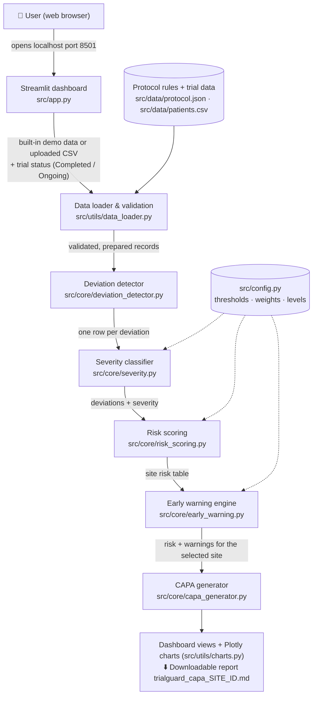

# Architecture

## System Architecture

TrialGuard is a **single local Python application**. A Streamlit web server runs on the
user's computer; the browser shows the dashboard. All processing happens in memory in one
Python process — there is **no database, no external API, no AI service and no login**.

The code follows one rule: **`app.py` only displays results.** Every decision (what is a
deviation, how serious it is, how risky a site is, what to recommend) lives in a separate,
testable module under `src/core/`.

`src/utils/dashboard_data.py` is the coordinator between the dashboard and the pipeline: it
calls the loader, detector, severity classifier, risk scoring and early-warning steps in
order, catches errors as user-friendly messages, and reshapes the results into tables for
`app.py`. When the user selects a site, `app.py` passes that site's results to the CAPA
generator.

## Components

| Component | Responsibility | Technology | File(s) |
|---|---|---|---|
| Dashboard UI | Sidebar (data source, trial status, site), metric cards, tabs, tables, warnings, CAPA display and download button. Contains no business rules. | Streamlit | `src/app.py` |
| Dashboard data orchestration | Runs every step in order (the analysis functions return user-friendly error messages instead of raising exceptions) and reshapes results into display tables | Python, pandas | `src/utils/dashboard_data.py` |
| Charts | Site risk bar chart (score + level on each bar, dashed LOW/MEDIUM/HIGH limits), deviation counts, risk points by factor | Plotly | `src/utils/charts.py` |
| Data loader & validation | Reads protocol JSON and patient CSV; rejects unusable files with clear messages; matches visit names, drops unknown visits and exact duplicates; produces data warnings | Python, pandas | `src/utils/data_loader.py` |
| Configuration | Deviation type names, severity thresholds, score weights, risk levels, warning thresholds | Python constants | `src/config.py` |
| Protocol rules | Visit schedule and windows, expected dose, prohibited medications | JSON | `src/data/protocol.json` |
| Synthetic trial data | 479 visit records, 120 patients, 10 sites; reproducible generator with planted problem sites | CSV + Python | `src/data/patients.csv`, `src/data/generate_synthetic_data.py` |
| Deviation detector | Missed, out-of-window, incorrect dose, prohibited medication, missing documentation; Completed vs Ongoing handling | Python, pandas | `src/core/deviation_detector.py` |
| Severity classifier | Major / Minor / Administrative plus a reason for each label; checks `config.py` is consistent | Python | `src/core/severity.py` |
| Risk scoring | Points, repeated-pattern bonus, normalisation by patients, 0–100 score, level, risk-factor breakdown, top factors | Python, pandas | `src/core/risk_scoring.py` |
| Early warning engine | Repeated dosing, repeated prohibited medications, increasing trend, high deviation rate; one-sentence headline | Python, pandas | `src/core/early_warning.py` |
| CAPA generator | Rule-based CAPA plan and Markdown report (download version and smaller on-screen headings) | Python | `src/core/capa_generator.py` |
| Automated tests | 334 unit and integration tests, including headless runs of the real dashboard | pytest, Streamlit `AppTest` | `src/tests/` |
| Check scripts | Quick human-readable checks of data, deviations, risk and the dashboard | Python | `src/check_*.py` |

## Data Flow

1. **Input.** The user opens the dashboard. By default it analyses the built-in
   `patients.csv`. Alternatively the user uploads a CSV and chooses **Completed** or
   **Ongoing** trial status. Uploaded files are handled as bytes in memory; nothing is
   written to disk.
2. **Validation and preparation** (`data_loader.py`). The protocol and CSV are read with every
   cell as text. Missing columns, empty files, malformed rows, non-numeric days or doses and
   blank IDs stop the analysis with a clear message. Usable records are prepared (visit names
   matched, unknown visits and exact duplicates removed) and any changes or suspicious values
   are reported as notes and warnings.
3. **Deviation detection** (`deviation_detector.py`). Each record is compared with its
   protocol visit. Protocol visits with no record are checked according to the trial status.
   Output: one row per deviation with expected value, actual value, explanation and days
   outside the window.
4. **Severity** (`severity.py`). Adds `severity` and `severity_rule` to every deviation.
5. **Risk scoring** (`risk_scoring.py`). Converts deviations into points, adds
   repeated-pattern bonuses, divides by the number of patients at the site, and scales to a
   0–100 score and LOW / MEDIUM / HIGH level. Sites with no deviations score 0.
6. **Early warnings** (`early_warning.py`). Checks each site for warning patterns and builds
   a headline from its top risk factors. The risk table is not modified.
7. **Display** (`dashboard_data.py` → `app.py` + `charts.py`). Results are shaped into tables
   and charts. The analysis result is cached by Streamlit (`st.cache_data`) so changing the
   selected site does not re-run the pipeline.
8. **CAPA** (`capa_generator.py`). When a site is selected, its risk row, warnings and
   deviations are passed to the CAPA generator, which returns Markdown. The dashboard shows a
   version with smaller headings and offers the full report through **Download CAPA report**
   as `trialguard_capa_<SITE_ID>.md`.

## Security Considerations

This is a **proof-of-concept for synthetic data**. The design choices below are appropriate
for a local demo, not for real patient data.

- **Synthetic data only.** All patients, sites, drugs and the protocol are fictional. No real
  patient data is included or required.
- **No credentials or secrets.** The application needs no API keys, passwords or environment
  variables. `.env` files are excluded by `.gitignore`.
- **No external services.** No data is sent to any AI service or third-party API by the
  application.
- **No database and no files written.** Uploaded data and generated reports stay in the memory
  of the local Streamlit process (including Streamlit's in-memory cache) until the app is
  stopped. Downloads are created only when the user clicks the button.
- **Input validation.** Uploaded CSVs are parsed as plain text, checked for required columns,
  row structure and numeric fields, and errors are shown as messages rather than tracebacks.
  User-provided text is displayed through Streamlit's standard components (raw HTML is not
  enabled), and pipe characters are escaped in the Markdown CAPA table.
- **Not included — required before any real use:** user authentication and access control,
  encryption, audit trails, data-retention rules, validated computer-system controls, and
  compliance with health-data regulations. **Do not deploy TrialGuard publicly or with real
  patient data.**

## Scalability Notes

- **Current scale.** The demo dataset (479 records) is analysed almost instantly on a laptop.
  TrialGuard has **not been performance-tested** on large datasets.
- **In-memory processing.** pandas loads the whole CSV into memory, and the detector checks
  records one by one in Python. This is simple to read but would become slow for very large
  trials; vectorised pandas operations or a database would be the next step.
- **Single-process web app.** Streamlit runs one Python process with results cached in memory.
  Supporting many users or large uploads would need a different deployment approach
  (for example, separate processing workers and persistent storage).
- **Rules as data.** Because the protocol is JSON and thresholds live in `config.py`, adding
  support for more visits or different limits does not require code changes. Supporting
  several protocols, calendar dates or per-arm dosing would require extending the data model.
