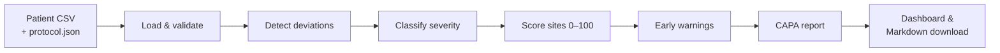

# Solution Overview

## What We Built

**TrialGuard** is a local web dashboard (built with Streamlit) that reads patient visit
records and a trial protocol, and then:

1. finds **protocol deviations**,
2. labels how **serious** each one is,
3. gives every site a **risk score from 0 to 100**,
4. raises **early warnings** that explain why a site is risky or getting worse, and
5. drafts a **CAPA report** (Corrective and Preventive Actions) that can be downloaded.

Everything is based on **transparent rules written in Python**, and everything runs on the
user's own computer using **synthetic data**.

> CAPA recommendations are **prototype, rule-based suggestions — not regulatory advice.**

## How It Works

### End-to-end pipeline



Each arrow is a separate Python module, so each step can be tested and explained on its own
(see [`architecture.md`](architecture.md)).

### 1. Load and validate the data — `src/utils/data_loader.py`

- Reads `protocol.json` (visits with expected day and window, expected dose, prohibited
  medications) and the patient CSV (`patient_id, site_id, visit, actual_day, dose_mg,
  medication`).
- Rejects files that cannot be analysed with a clear message: missing columns, empty files,
  rows with extra values, text in number columns, blank IDs.
- Prepares the records: matches visit names ignoring capitals and spacing, ignores records
  whose visit is not in the protocol, and removes exact duplicates — telling the user about
  each change.

### 2. Detect deviations — `src/core/deviation_detector.py`

| Deviation | Rule |
|---|---|
| Missed visit | A record with a blank `actual_day`, or a protocol visit with no record |
| Out-of-window visit | `actual_day` outside `expected_day ± window_days` (the number of days outside is stored) |
| Incorrect dose | `dose_mg` is not the protocol dose |
| Prohibited medication | A listed medication is on the protocol's prohibited list (one deviation per drug) |
| Missing documentation | A visit that happened has a blank dose or medication |

Every deviation records the **expected value, actual value and a plain-English explanation**.

### 3. Classify severity — `src/core/severity.py`

- Missed visit, incorrect dose, prohibited medication → **Major**
- Missing documentation → **Administrative**
- Out-of-window visit → **Administrative** (1–2 days outside), **Minor** (3–7 days) or
  **Major** (more than 7 days)

Each deviation also gets a `severity_rule` column explaining *why*, for example
"8 day(s) outside window: more than 7 days is Major".

### 4. Score each site — `src/core/risk_scoring.py`

```
points per deviation = severity points (Major 10, Minor 4, Administrative 1)
                     + type bonus (dose +5, prohibited medication +7, missed/late visit +3)
total points         = sum of deviation points
                     + 5 for each deviation type seen in 2+ different patients (repeated pattern)
points per patient   = total points ÷ patients at the site
risk score           = min(100, points per patient ÷ 25 × 100), rounded
risk level           = 0–30 LOW · 31–60 MEDIUM · 61–100 HIGH
```

- Dividing by patients means a big site is not called risky just because it is big.
- The scale is **fixed** (25 points per patient = 100), so a site's score does not change
  because another site improved.
- Every point belongs to one **risk factor** (dosing errors, prohibited medications, late or
  missed visits, missing documentation, repeated patterns). The factors add up exactly to
  the total and the top three are shown.

### 5. Early warnings — `src/core/early_warning.py`

Warnings **explain** the score; they never change it.

| Warning | Fires when |
|---|---|
| Repeated dosing errors | 2 or more dosing deviations at the site |
| Repeated prohibited medications | 2 or more prohibited-medication incidents |
| Increasing deviation trend | Later visits (second half of the schedule) have at least twice as many deviations as early visits **and** at least 3 more |
| Unusually high deviation rate | Deviations per expected visit are more than twice the study-wide rate |

Each site also gets a one-sentence headline, e.g. *"Repeated dosing deviations and repeated
prohibited medication incidents are driving elevated site risk."*

### 6. CAPA report — `src/core/capa_generator.py`

The generator receives the site's already-calculated risk row, warnings and deviations, and
builds a Markdown report: summary, deviations table, affected patients, **likely
contributing issues (rule-based hypotheses)**, corrective actions, preventive actions and a
monitoring recommendation.

- Issues and actions come from **small editable lookup tables**. For example, dosing errors
  map to *"Dosing procedure or dose verification"* with actions such as *"Verify recent
  dosing records"* and *"Add a second-person verification step for dosing"*.
- A factor must provide at least 10% of the site's risk points to be treated as a process
  issue, so one small slip does not generate a list of unrelated actions.
- Sites with no deviations and no warnings are told that no CAPA actions are indicated.

### 7. Dashboard — `src/app.py`

- **Sidebar:** choose built-in demo data or upload a CSV; choose a site.
- **Metrics:** sites, patients, deviations, HIGH- and MEDIUM-risk sites, sites with warnings.
- **Study overview tab:** site risk ranking table, Plotly bar chart of risk scores (each bar
  labelled with score and level), sites with early warnings, deviations by type and severity.
- **Site details tab:** score, level, counts, numbered early warnings, top risk factors, CAPA
  report with **Download CAPA report**, and filterable deviation records.
- **How it works tab:** the current rules, read live from `config.py`.
- Risk levels are always written as words (HIGH / MEDIUM / LOW), not shown by colour alone.

### CSV upload and Completed vs Ongoing trials

When a CSV is uploaded, the user chooses a **Trial status**:

| Trial status | A protocol visit with **no record** counts as missed when… |
|---|---|
| **Completed** (default, used by the demo data) | always |
| **Ongoing** | the patient already has a record for a **later** visit |

In Ongoing mode, visits after a patient's last record are treated as **not yet due**, and the
dashboard shows how many there are. This avoids falsely flagging patients who simply have not
reached their later visits. A record with a blank `actual_day` is always a missed visit.

## What Makes It Different

Many basic checks stop at listing individual deviations. TrialGuard combines, for each site:

**deviation detection + severity + site-level risk + trend warnings + action recommendations**

and keeps every step **traceable**: a judge or monitor can click from a site's score to its
risk factors, to the warnings, to the individual deviations with their expected and actual
values, and see the exact rule behind each label.

## Key Design Decisions

| Decision | Rationale |
|---|---|
| **Rule-based, not machine learning** | Rules are transparent and easy to explain and test. With only synthetic data there is nothing real to learn from, and results must be traceable. |
| **All thresholds and weights in `config.py`** | Rules can be changed without touching the logic; the dashboard's "How it works" tab reads the live values. |
| **Protocol stored as data (`protocol.json`)** | Changing visits, windows, dose or prohibited medications does not require code changes (tests confirm results follow the protocol file). |
| **Score normalised by patients, with a fixed cap** | Fair to large sites, and scores do not depend on other sites. |
| **Warnings separate from the score** | Warnings explain *why*; keeping them out of the formula keeps the score simple and predictable. |
| **CAPA text from lookup tables, not an AI model** | Deterministic, explainable output that never invents facts; clearly labelled as hypotheses and prototype recommendations. |
| **Business logic outside `app.py`** | The dashboard only displays results, so every rule can be unit-tested without Streamlit. |
| **Synthetic data with planted problem sites** | Safe to share, and it lets tests confirm the pipeline finds known problems (SITE-104 and SITE-107). |
| **Completed vs Ongoing option for uploads** | Avoids false "missed visit" results for mid-trial data without changing the demo's results. |

## IBM Technologies Used

**None.** TrialGuard does not use IBM Bob, watsonx.ai or any other IBM technology. All logic is
deterministic Python (pandas), the dashboard is Streamlit with Plotly charts, and no external
AI service is called.

## Results on the Synthetic Demo Data

| Site | Risk score | Level | Deviations | Early warnings |
|---|---|---|---|---|
| SITE-104 | 68 | HIGH | 14 | Repeated dosing errors, repeated prohibited medications, increasing trend, high deviation rate |
| SITE-107 | 52 | MEDIUM | 15 | Increasing trend, high deviation rate |
| SITE-105 | 0 | LOW | 0 | None |
| SITE-110 | 0 | LOW | 0 | None |

Across all 10 sites: 42 deviations (23 Major, 8 Minor, 11 Administrative) and 7 early
warnings at 3 sites. These results show that the planted problems are found; they do not
demonstrate accuracy on real trial data.
